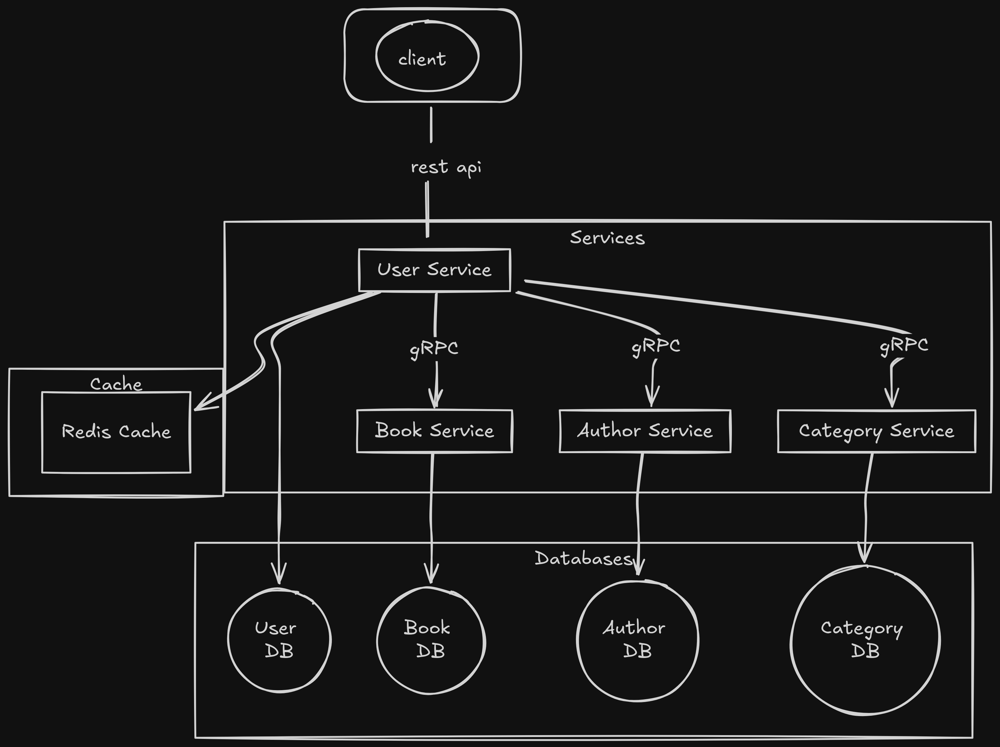
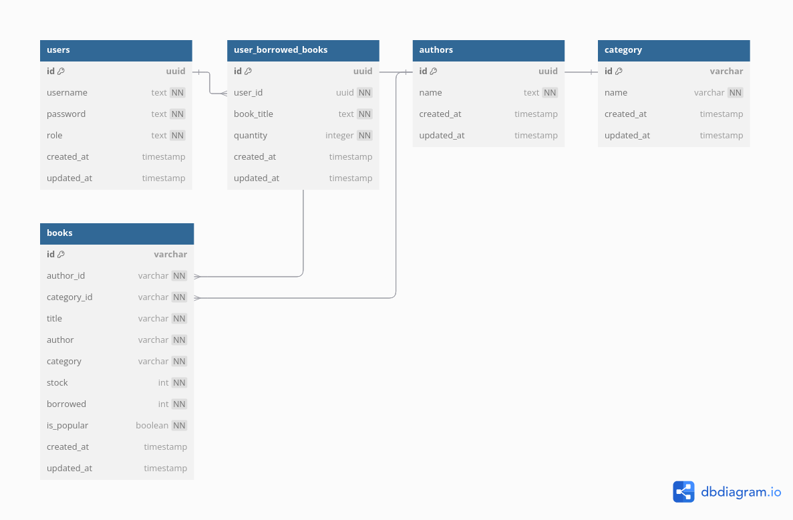

# Book Management System

## Overview

This project is a Book Management System designed with a microservice architecture. It allows users to manage books, authors, stock, and categories. The system also supports user authentication and authorization, ensuring that only users with the admin role can perform management tasks.

## Project structure
```
- `internal/`: Application code
    - `user/`: User service implementations
    - `book/`: Book service implementations
    - `category/`: Category service implementations
    - `author/`: Author service implementations
    - `pkg/`: global utility implementation
- `api/`: API definitions
    - `openapi/`: OpenAPI specifications
    - `postman/`: Postman collections
    - `grpc/`: gRPC proto files
- `scripts/`: Utility scripts
- `deployment/`: Deployment configurations
    - `docker-compose/`: Docker Compose files
```

## Prerequisites

- Go
- Docker
- Docker Compose

## System Design



## Entity Relationship Diagram (ERD)



## To run integration test you can use
give permission to script first
```bash
chmod +x ./scripts/integration_test.sh
```
then run it
```bash
./scripts/integration_test.sh
```

or use
```bash
make test
```

## Running the Code

To run the Book Management System, use Docker Compose. Navigate to the `deployment/docker-compose` directory and run the following command:

```sh
docker-compose -f docker-compose.yml up -d
```

This command will start all the necessary services in detached mode.

## User Roles and Permissions

- **Admin Users**: Can manage books, authors, stock, and categories.
- **Non-Admin Users**: Can view books, borrow books, and return books.

## API Endpoints

### User

- **Signup**: `POST /user/signup`
- **Signin**: `POST /user/signin`
- **Signup Admin**: `POST /user/signup-admin`
- **Signin Admin**: `POST /user/signin-admin`

### Author

- **Create Author**: `POST /author`
- **List Authors**: `GET /author`
- **Delete Author**: `DELETE /author/{id}`
- **Update Author**: `PUT /author/{id}`

### Book

- **Create Book**: `POST /book`
- **List Books**: `GET /book`
- **Borrow Book**: `POST /book/borrow`
- **Return Book**: `POST /book/return`
- **Delete Book**: `DELETE /book/{id}`
- **List Popular Books by Category (recommendation based on popularity, i.e., books borrowed many times)**: `GET /book/popular`
- **List User Borrowed Books**: `GET /book/user`
- **Search book by title**: `Get /book/title/{title}`

### Category

- **Create Category**: `POST /category`
- **List Categories**: `GET /category`
- **Delete Category**: `DELETE /category/{id}`
- **Update Category**: `PUT /category/{id}`